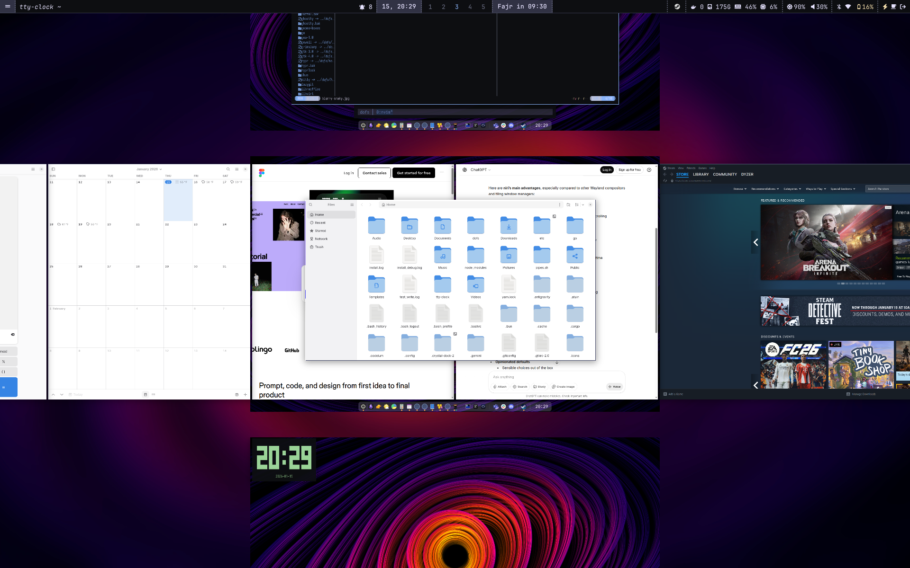
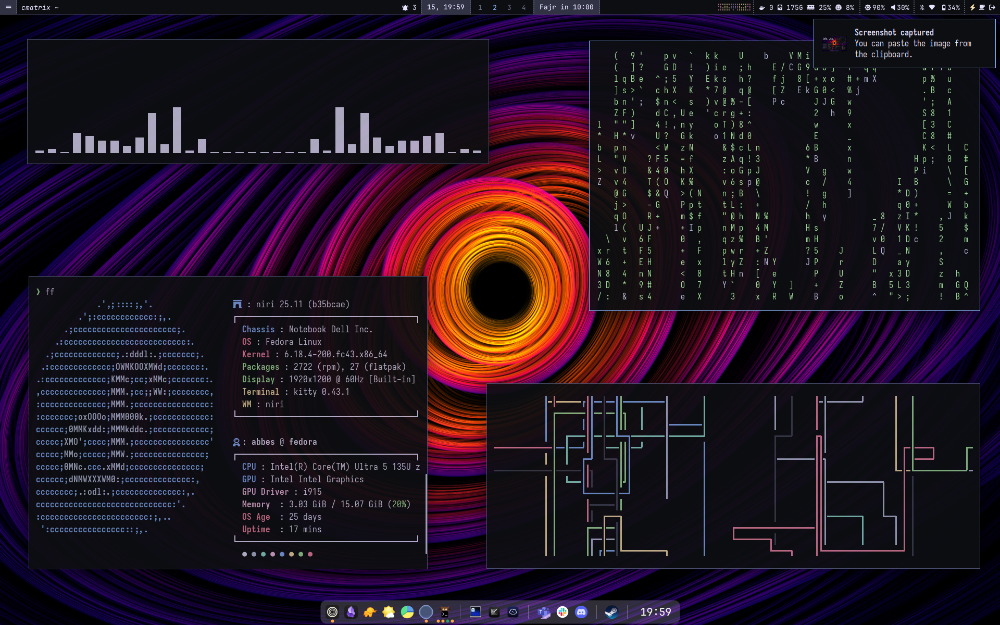
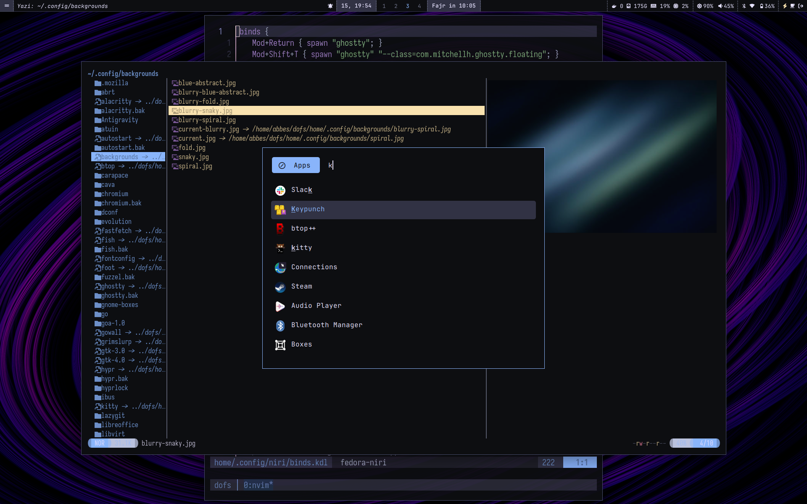

# Own your DOtFileS with dofs - Fedora Workstation + Niri

<table align="center">
  <tr>
    <td align="center" width="50%">
      
      <br>
      <b>Niri Overview</b>
    </td>
    <td align="center" width="50%">
      
      <br>
      <b>Decoration Apps</b>
    </td>
  </tr>
  <tr>
    <td align="center" width="50%">
      
      <br>
      <b>Niri Binds</b>
    </td>
    <td align="center" width="50%">
      
      <br>
      <b>Yazi Floating</b>
    </td>
  </tr>
</table>

A unified, reproducible dotfiles setup for Fedora Workstation featuring:

- **Niri** - Scrollable-tiling Wayland compositor
- **WezTerm** - GPU-accelerated terminal emulator
- **Rofi** - Highly customizable application launcher
- **Waybar** - Highly customizable status bar
- **Mako** - Lightweight notification daemon
- **Fish** shell with **Hydro** prompt

## Quick Start

Run this command in your terminal:

```bash
bash -c "$(curl -fsSL https://raw.githubusercontent.com/abbesm0hamed/dofs/fedora-niri/bootstrap.sh)"
```

This will:

- Install all packages from lists (system, desktop, wayland, etc.)
- Stow dotfiles into your home directory (including `~/.config`)
- Apply the unified default theme

## Manual Installation

If you prefer to clone the repository manually, follow these steps:

```bash
# Clone the repository
git clone --branch fedora-niri https://github.com/abbesm0hamed/dofs.git ~/dofs
cd ~/dofs
./install.sh

# Run the installer
# Use APPLY_ETC=1 to also apply system-level configs (e.g., lid suspend behavior)
# This will require sudo password.
APPLY_ETC=1 ./install.sh
```

## Test Installation in a Container (Recommended)

If you don't want to run the installer directly on your machine, you can validate the bootstrap in a clean Fedora container.

```bash
git clone --branch fedora-niri https://github.com/abbesm0hamed/dofs.git ~/dofs
cd ~/dofs
bash tests/test-install.sh
```

Notes:

- The test prefers `podman` if available, otherwise it uses `docker`.
- The test runs `./install.sh --non-interactive` and then `./scripts/setup/verify.sh` inside the container.

## Reboot

```bash
reboot
```

## ⚡ Optimizations

This setup includes:

### Niri Best Practices

- **xwayland-satellite** for X11 app compatibility (Discord, Steam, etc.)
- **xdg-desktop-portal-gnome** for better screen sharing
- **GDM** (GNOME Display Manager) with Niri session support
- **Optimized autostart** with proper service ordering
- **Hyprlock** with blur effects for secure screen locking

### Single-Command Installation

- One command installs everything
- Automatic validation before completion
- Declarative package management
- Reproducible setup

## What Gets Installed

### System Packages

- Base development tools, git, network manager
- Fish shell, Hydro prompt
- Bluetooth, SSH, power management tools...

### Development Tools

- Node.js (fnm), Python, Rust, Go
- Docker, Kubernetes, Terraform
- Neovim, code quality tools, debuggers...

### Desktop Applications

- Chromium, Zen Browser
- Nautilus file manager
- Slack, Discord
- Zathura PDF viewer
- And many more...

### Wayland Stack

- **Niri** compositor
- **Waybar** status bar
- **Mako** notifications
- Screenshot, recording, clipboard tools

### Gaming

- **Steam** with Wayland optimizations
- **Gamescope** for compositing and scaling
- **MangoHUD** for performance overlays
- **Proton** for Windows game compatibility

**Steam Wayland Fix**: Steam is configured with `-system-composer -no-cef-sandbox` flags in `~/.local/share/applications/steam.desktop` to fix black screen issues on Wayland. The `gaming.sh` setup script automatically applies these flags to the Steam desktop entry and all its actions (Store, Community, Library, etc.).

### Unified Management

This setup includes a central manager script `dofs` (symlinked to `~/.local/bin/dofs`) to simplify everyday tasks:

```bash
# Run the full installation or a specific setup script (e.g., 'shell')
dofs install [script]

# Update everything (DNF, Flatpak, Nvim, Fish plugins)
dofs update

# Run a comprehensive health check (symlinks, services, PATH, etc.)
dofs doctor

# Verify your configuration symlinks and health
dofs verify

# Run installation test in a clean container (Fedora)
dofs test

# Uninstall configurations and symlinks managed by dofs
dofs uninstall
```

## Customization

### Add a New Package

Edit the relevant file in `packages/`:

```bash
# Add to development tools
echo "my-new-package" >> packages/development.txt

# Reinstall
./install.sh
```

## Troubleshooting

### Niri won't start

- Check if Wayland is supported: `echo $WAYLAND_DISPLAY`
- Verify Niri is installed: `which niri`
- Check logs: `journalctl -u niri`

### Packages not installing

- Check internet connection
- Try manual install: `sudo dnf install package-name`
- For Flatpak apps: `flatpak install package-name`

## Keybindings

For a detailed and auto-generated list of all keybindings for Niri and Neovim, please see the [KEYBINDINGS.md](KEYBINDINGS.md) file.

### System Mode (Exit Menu)

Press `ALT + L` to open the power menu, which provides options for:

- Logout
- Reboot
- Hibernate
- Sleep

## Additional Features

- **Keyboard Layout**: Toggle between US and Arabic layouts using `Super + Alt + Shift + Space`
- **Auto-tiling**: Dynamic tiling layout
- **Workspace Auto Back and Forth**: Enabled
- **Smooth Animations**: Advanced animation system

## 📓 Obsidian Google Drive Sync

This setup uses **rclone bisync** to keep a local copy of your notes synchronized bidirectionally with Google Drive.

1. **Authenticate**: Run `rclone config` and create a remote named `gdrive`. For best results, create your own **Google OAuth Client ID** in the Google Cloud Console to avoid rate limiting. (Path: _APIs & Services > Credentials > Create Credentials > OAuth client ID_).
2. **Enable API**: Ensure the **Google Drive API** is enabled in your [Google Cloud Console](https://console.developers.google.com/apis/api/drive.googleapis.com/overview).
3. **Setup**: Run `bash ~/dofs/scripts/setup/obsidian.sh`. This initializes the vault and enables background sync.
4. **Use**:
   - **Manual Sync**: Press `<leader>oz` in Neovim to trigger an immediate sync.
   - **Search**: Use `<leader>os` to search your notes using the Snacks picker.
   - **Quick Note**: Use `<leader>on` to create a new note from anywhere.
5. **Performance**: Since notes are stored locally in `~/vaults/google-drive`, the picker is instant. Background sync runs every 30 minutes via a systemd timer.
6. **Reliability**: Uses `rclone bisync` with `size` and `modtime` comparison for fast, reliable updates.
