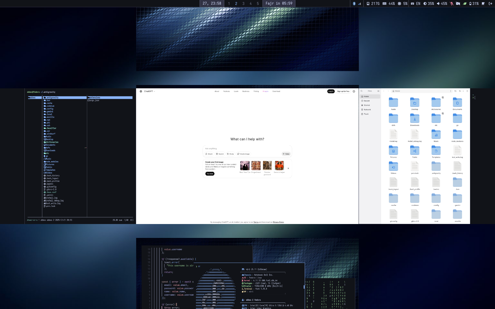
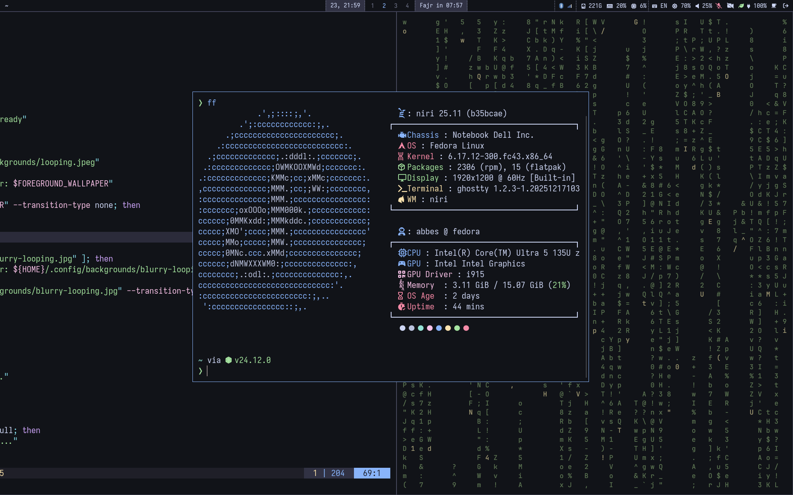

# dofs - Fedora Workstation Dotfiles with Niri




A unified, reproducible dotfiles setup for Fedora Workstation featuring:

- **Niri** - Scrollable-tiling Wayland compositor
- **Ghostty** - Fast, waybar native terminal emulator
- **Waybar** - Highly customizable status bar
- **Mako** - Lightweight notification daemon
- **Fish** shell with **Starship** prompt
- **Unified theme system** - Consistent theming across all applications

## Quick Start

Run this command in your terminal:

```bash
bash -c "$(curl -fsSL https://raw.githubusercontent.com/abbesm0hamed/dofs/fedora-niri/bootstrap.sh)"
```

This will:

- Install all packages from lists (system, desktop, wayland, etc.)
- Stow all dotfiles to `~/.config`
- Apply the unified default theme
- Enable the Niri session in GDM (GNOME Display Manager)

**Time**: ~15-20 minutes

## Manual Installation

If you prefer to clone the repository manually, follow these steps:

```bash
git clone --branch fedora-niri https://github.com/abbesm0hamed/dofs.git ~/dofs
cd ~/dofs
./install.sh
```

### 3. Reboot and Enjoy

```bash
reboot
```

## ⚡ Optimizations

This setup includes:

### Niri Best Practices

- **xwayland-satellite** for X11 app compatibility (Discord, Steam, etc.)
- **xdg-desktop-portal-gnome** for better screen sharing
- **GDM** (GNOME Display Manager) with Niri session support
- **Optimized autostart** with proper service ordering
- **Swaylock** with blur effects for secure screen locking

### Single-Command Installation

- One command installs everything
- Automatic validation before completion
- Declarative package management
- Reproducible setup

## What Gets Installed

### System Packages

- Base development tools, git, network manager
- Fish shell, Starship prompt
- Bluetooth, SSH, power management tools...

### Development Tools

- Node.js (fnm), Python, Rust, Go
- Docker, Kubernetes, Terraform
- Neovim, code quality tools, debuggers...

### Desktop Applications

- Chromium, Zen Browser
- Nautilus file manager
- Slack, Discord
- Zathura PDF viewer
- And many more...

### Wayland Stack

- **Niri** compositor
- **Waybar** status bar
- **Mako** notifications
- Screenshot, recording, clipboard tools

### Unified Management

This setup includes a central manager script `dofs` (symlinked to `~/.local/bin/dofs`) to simplify everyday tasks:

```bash
# Run the full installation or a specific setup script (e.g., 'shell')
dofs install [script]

# Update everything (DNF, Flatpak, Nvim, Fish plugins)
dofs update

# Run a comprehensive health check (symlinks, services, PATH, etc.)
dofs doctor

# Verify your configuration symlinks and health
dofs verify

# Run installation test in a clean Docker container (Fedora)
dofs test

# Uninstall configurations and symlinks managed by dofs
dofs uninstall
```

## Customization

### Add a New Package

Edit the relevant file in `packages/`:

```bash
# Add to development tools
echo "my-new-package" >> packages/development.txt

# Reinstall
./install.sh
```


## Troubleshooting

### Niri won't start

- Check if Wayland is supported: `echo $WAYLAND_DISPLAY`
- Verify Niri is installed: `which niri`
- Check logs: `journalctl -u niri`

### Packages not installing

- Check internet connection
- Try manual install: `sudo dnf install package-name`
- For Flatpak apps: `flatpak install package-name`

## Keybindings

For a detailed and auto-generated list of all keybindings for Niri and Neovim, please see the [KEYBINDINGS.md](KEYBINDINGS.md) file.

### System Mode (Exit Menu)

Press `ALT + L` to open the power menu, which provides options for:

- Logout
- Reboot
- Hibernate
- Sleep

## Additional Features

- **Keyboard Layout**: Toggle between US and Arabic layouts using `Super + Alt + Shift + Space`
- **Auto-tiling**: Dynamic tiling layout
- **Workspace Auto Back and Forth**: Enabled
- **Smooth Animations**: Advanced animation system
