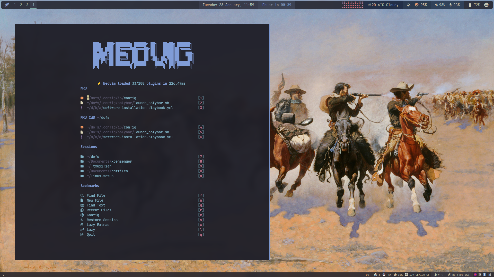

# My Linux Rice Setup

A minimalist and elegant desktop environment built with i3 window manager, featuring the beautiful Kanagawa color scheme. The setup emphasizes both aesthetics and functionality, with a cohesive dark theme inspired by The Great Wave off Kanagawa.

## Screenshots


*System monitoring with macchina, neovim, and btop - all themed with Kanagawa colors*


*NVIM + setup*


*Terminal tools (ranger, ttyclock, cava) running in i3 with Kanagawa theme*


## Installation

### Prerequisites

1. Clone the repository:

```bash
git clone https://github.com/abbesm0hamed/dofs.git ~/dofs
cd ~/dofs
```

2. Automated Software Installation

The repository includes an automated installation script using Ansible. To install all required software:

```bash
cd bootstrap/arch
chmod +x install.sh software-installation-playbook.yml
./install.sh 
ansible-playbook -K software-installation-playbook.yml
```

This will install:

- Window Manager: i3-gaps, i3ass
- Shell: zsh (set as default)
- Development Tools: neovim, vscode, docker, git tools
- Terminal Utilities: tmux, ranger, btop, cava
- System Tools: picom, polybar, rofi, dunst
- Fonts and Themes: nerd-fonts, lxappearance
- Media Applications: mpv, vlc, gimp
- And many more essential packages

3. Use GNU stow to create symlinks:

```bash
cd ~/dofs
stow .
```

## Color Palette

The rice uses the Kanagawa color scheme, a dark theme that draws inspiration from the traditional colors of Japanese painting:

<div style="display: flex; gap: 10px; flex-wrap: wrap; padding: 10px; background: #1F1F28; border-radius: 5px;">
    <div style="padding: 20px 30px; color: white; border-radius: 3px; background: #7E9CD8">Focused (#7E9CD8)</div>
    <div style="padding: 20px 30px; color: white; border-radius: 3px; background: #2A2A37">Inactive (#2A2A37)</div>
    <div style="padding: 20px 30px; color: white; border-radius: 3px; background: #1F1F28">Background (#1F1F28)</div>
    <div style="padding: 20px 30px; color: white; border-radius: 3px; background: #C34043">Urgent (#C34043)</div>
    <div style="padding: 20px 30px; color: black; border-radius: 3px; background: #DCD7BA">Text (#DCD7BA)</div>
    <div style="padding: 20px 30px; color: white; border-radius: 3px; background: #957FB8">Indicator (#957FB8)</div>
    <div style="padding: 20px 30px; color: white; border-radius: 3px; background: #727169">Unfocused (#727169)</div>
    <div style="padding: 20px 30px; color: white; border-radius: 3px; background: #C8C093">Inactive Text (#C8C093)</div>
</div>

### Color Assignments

- **Focused Windows**: Border and background `#7E9CD8` with text `#DCD7BA`
- **Inactive Windows**: Border and background `#2A2A37` with text `#C8C093`
- **Unfocused Windows**: Border and background `#1F1F28` with text `#727169`
- **Urgent Windows**: Border and background `#C34043` with text `#DCD7BA`
- **Default Background**: `#1F1F28`

## Keybindings Documentation

This document provides a comprehensive list of all keyboard shortcuts configured in the system.

## Table of Contents

- [Window Management (i3)](#window-management-i3)
- [Workspace Controls](#workspace-controls)
- [Application Shortcuts](#application-shortcuts)
- [Media Controls](#media-controls)
- [System Controls](#system-controls)
- [Screenshots](#screenshots)
- [Applications](#applications)

## Window Management (i3)

| Keybinding | Action |
|------------|--------|
| `Super + h/j/k/l` | Focus left/down/up/right |
| `Super + Shift + h/j/k/l` | Move window left/down/up/right |
| `Super + z` | Split vertically |
| `Super + x` | Split horizontally |
| `Super + f` | Toggle fullscreen |
| `Super + Shift + f` | Toggle floating mode |
| `Super + Space` | Toggle focus between floating/tiling |
| `Super + a` | Focus parent |
| `Super + Ctrl + h/j/k/l` | Resize window |
| `Super + y` | Toggle polybar |

## Workspace Controls

| Keybinding | Action |
|------------|--------|
| `Super + (1-9,0)` | Switch to workspace 1-10 |
| `Super + Shift + (1-9,0)` | Move container to workspace 1-10 |
| `Super + Shift + b` | Move workspace to next output |

## Application Shortcuts

| Keybinding | Action |
|------------|--------|
| `Super + Shift + Return` | Launch Krusader |
| `Super + F1` | Launch Vivaldi |
| `Super + F2` | Launch Atom |
| `Super + F3` | Launch Inkscape |
| `Super + F4` | Launch GIMP |
| `Super + F5` | Launch Meld |
| `Super + F6` | Launch VLC |
| `Super + F7` | Launch VirtualBox |
| `Super + g` | Launch Google Chrome |
| `Ctrl + Alt + s` | Launch Flameshot GUI |
| `Super + q` | Quick Settings panel |

## Media Controls

| Keybinding | Action |
|------------|--------|
| `XF86AudioRaiseVolume` / `Alt + d` | Volume up |
| `XF86AudioLowerVolume` / `Alt + a` | Volume down |
| `XF86AudioMute` | Toggle mute |
| `XF86AudioPlay` / `Ctrl + Alt + p` | Play/Pause |
| `XF86AudioNext` / `Ctrl + Shift + .` | Next track |
| `XF86AudioPrev` / `Ctrl + Shift + ,` | Previous track |
| `Alt + Shift + h/j/k/l` | MPD: Previous/Next/Play/Pause |

## System Controls

| Keybinding | Action |
|------------|--------|
| `Super + Shift + q` | Kill focused window |
| `Super + Shift + c` | Reload i3 config |
| `Super + Shift + r` | Restart i3 |
| `Super + Escape` | Reload sxhkd configuration |

## Screenshots

| Key Combination | Action |
|----------------|--------|
| `Super + Shift + Z` | Create Screenshots directory |
| `Alt + Super + S` | Active window screenshot |
| `Alt + Shift + S` | Full screenshot |
| `Ctrl + Alt + S` | GUI selection tool |

All screenshots are automatically saved to `~/Pictures/Screenshots` and copied to clipboard.

## Applications

| Key Combination | Action |
|----------------|--------|
| `Super + b` | Open Brave browser |
| `Super + g` | Open Google Chrome |
| `Super + enter` | Kitty |
| `Alt + enter` | Ghostty |
| `Alt + Ctrl + enter` | Wezterm |
| `Alt + Ctrl + t` | Alacritty |

### Neovim Keybindings

The following are the custom keybindings configured for Neovim:

| Keybinding | Mode | Description |
|------------|------|-------------|
| `<Space>` | All | Leader key |
| `<leader>w` | Normal | Save file |
| `J` | Visual | Move line down |
| `K` | Visual | Move line up |
| `jk` | Insert | Exit insert mode (ESC) |
| `<leader>q` | Normal | Quit Neovim |
| `+` | Normal | Increment number |
| `-` | Normal | Decrement number |
| `<C-a>` | Normal | Select all text |
| `<` / `>` | Visual | Indent/Unindent selection |
| `te` | Normal | New tab |
| `<leader>sh` | Normal | Split window horizontally |
| `<leader>sv` | Normal | Split window vertically |
| `<C-h/j/k/l>` | Normal | Navigate between splits |
| `<leader>th` | Normal | Change splits to horizontal |
| `<leader>tk` | Normal | Change splits to vertical |
| `<C-Up/Down/Left/Right>` | Normal | Resize window |
| `<Tab>` / `<S-Tab>` | Normal | Next/Previous buffer |
| `<leader>x` | Normal | Close buffer |
| `<A-p>` | Normal | Pin buffer |
| `<leader>co` | Normal/Visual | Toggle comment |
| `<leader>b` | Normal | Toggle Neotree |
| `<leader>nb` | Normal | Show Neotree buffer in float |
| `<leader>ff` | Normal | Telescope find files |
| `<leader>fg` | Normal | Telescope live grep |
| `<leader>fr` | Normal | Telescope recent files |
| `<leader>fb` | Normal | Telescope buffers |
| `<leader>S` | Normal | Toggle Spectre |
| `<leader>sw` | Normal/Visual | Search current word |
| `<leader>sp` | Normal | Search in current file |

#### Git Integration Keybindings

| Keybinding | Mode | Description |
|------------|------|-------------|
| `ga` | Normal | Stage hunk |
| `ga` | Visual | Stage selection |
| `gA` | Normal | Stage entire buffer |
| `<leader>gv` | Normal | Toggle deleted lines view |
| `<leader>ua` | Normal | Undo last stage |
| `<leader>uh` | Normal | Reset hunk |
| `<leader>ub` | Normal | Reset buffer |
| `<leader>ob` | Normal | Toggle git blame |
| `gh` | Normal | Next hunk |
| `gH` | Normal | Previous hunk |
| `gh` | Visual/Operator | Select hunk |

#### DiffView Keybindings

| Keybinding | Mode | Description |
|------------|------|-------------|
| `<leader>q` | Normal | Close DiffView |
| `<leader>ch` | Normal | Choose current version in conflict |
| `<leader>cl` | Normal | Choose incoming version in conflict |
| `<leader>cb` | Normal | Choose base version in conflict |
| `<leader>ca` | Normal | Choose all versions in conflict |
| `<leader>cx` | Normal | Choose none in conflict |
| `do` | Normal | Get diff from other file |
| `dp` | Normal | Put diff to other file |
| `j/k` | Normal | Navigate entries in file panel |
| `<cr>` | Normal | Select entry in file panel |

#### File Operations Keybindings

| Keybinding | Mode | Description |
|------------|------|-------------|
| `<C-p>` | Normal | Copy file path (with ~) |
| `<C-t>` | Normal | Copy relative path |
| `<C-n>` | Normal | Copy filename |
| `<C-r>` | Normal | Rename file |
| `<D-m>` | Normal | Move file |
| `<leader>x` | Normal | Make file executable (chmod +x) |
| `<A-d>` | Normal | Duplicate file |
| `<D-BS>` | Normal | Move file to trash |
| `<D-n>` | Normal | Create new file |
| `X` | Visual | Move selection to new file |
| `-` | Normal | Open parent directory (Oil) |

#### Editing Support Keybindings

| Keybinding | Mode | Description |
|------------|------|-------------|
| `gcc` | Normal | Toggle line comment |
| `Q` | Normal | Comment at end of line |
| `qO` | Normal | Comment above |
| `qo` | Normal | Comment below |
| `<leader>ut` | Normal | Toggle Undotree |
| `<leader>tp` | Normal | Toggle Puppeteer |
| `<leader>tj` | Normal | Toggle split/join lines |
| `<leader>tJ` | Normal | Split line (markdown, applescript) |

#### Mini Plugins Keybindings

| Keybinding | Mode | Description |
|------------|------|-------------|
| `gsa` | Normal/Visual | Add surrounding |
| `gsd` | Normal | Delete surrounding |
| `gsf` | Normal | Find surrounding (right) |
| `gsF` | Normal | Find surrounding (left) |
| `gsh` | Normal | Highlight surrounding |
| `gsr` | Normal | Replace surrounding |
| `gsn` | Normal | Update surrounding lines |

#### Outline Navigation

| Keybinding | Mode | Description |
|------------|------|-------------|
| `<leader>ou` | Normal | Toggle outline |
| `<Esc>`, `q` | Normal | Close outline |
| `<CR>` | Normal | Go to location |
| `o` | Normal | Focus location |
| `<C-space>` | Normal | Hover symbol |
| `K` | Normal | Toggle preview |
| `r` | Normal | Rename symbol |
| `a` | Normal | Code actions |
| `h` | Normal | Fold |
| `l` | Normal | Unfold |
| `W` | Normal | Fold all |

*Note: This is not an exhaustive list. There are more keybindings available in other plugins. Check the plugin documentation for more details.*

### System Mode (Exit Menu)

Press the configured key combination to enter system mode, then:

- `l` : Logout
- `r` : Reboot
- `h` : Hibernate
- `s` : Sleep
- `p` : Power off
- `Escape` : Cancel

## Additional Features

- **Keyboard Layout**: Toggle between US and Arabic layouts using `Alt + Shift`
- **Auto-tiling**: Enabled by default
- **Workspace Auto Back and Forth**: Enabled

Note: Some keybindings might be commented out in the config files. This documentation shows only the active keybindings.

## Inspiration

- [The Linux Cast Dotfiles](https://gitlab.com/thelinuxcast/my-dots.git)
- [Polybar Config by Brannigan123](https://github.com/Brannigan123/polybar-config.git)
- [Nvim Config by Allaman](https://github.com/Allaman/nvim)
- [Chris Grieser Config](https://github.com/chrisgrieser/.config)

